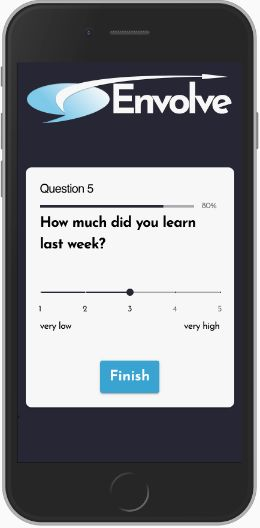

# EnVolve
## Enhance education, involve pupils! 

##### This is an app to improve communication between students and their teachers. The approach is to establish a continuous student-side feedback loop to allow students to share their interests, ideas, wishes, criticisms and so on. Based on this information, the teacher can design lessons in the interest of the students, thereby increasing their motivation to learn and ultimately improving the quality of learning.

### Impressions

